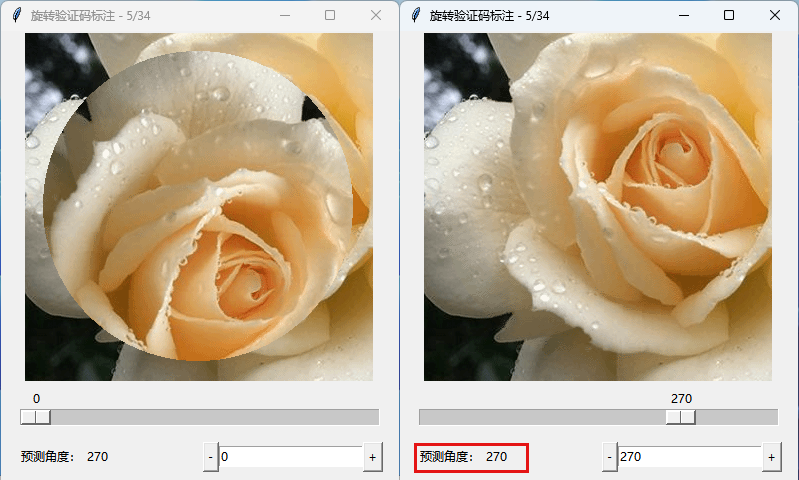

# chaoxing_rotate_captcha

一个预测图片旋转角度的 CNN 网络，可用于破解超星旋转验证码。

数据集为 430 张验证码，按 8:1:1 的比例划分为训练集、验证集和测试集。

将误差在 2 度范围内视为准确，经多次测试，准确率均在 95% 以上。平均偏差在 1.5° 左右。

示例:



<br />

## 目录

- [上手指南](#上手指南)
  - [训练环境配置](#训练环境配置)
  - [体验已有模型](#体验已有模型)
- [文件目录说明](#文件目录说明)
- [网络结构](#网络结构)
- [相关链接](#相关链接)

### 上手指南

###### 训练环境配置

- 深度学习必备环境 CUDA 和 pytorch
- 拉取代码
- 安装依赖

###### **体验已有模型**

- 下载预训练权重
- 使用提供的 pred.py 脚本即可

```python
from pred import RotNetW
# ./models/best_acc.pt
model = RotNetW(weights_path = "预训练权重路径")
# 返回预测的旋转角
angle = model.pred(center_path = "./center.png", border_path = "./border.png")
```

### 文件目录说明

eg:

```
filetree
├── README.md
├── /data/                验证码数据集
│  ├── /border/           验证码外部边框图片 不区分训练集和验证集
│  ├── /center/           验证码中心旋转体图片 区分训练集和验证集
│  │  ├── /train/         训练集
│  │  └── /test/          验证集
├── /models/              模型存放
│  ├── best_acc.pth       最大准确率模型
│  ├── best_diff.pth      最小偏差模型
│  ├── last.pth           最后一次训练模型
├── /utils/
│  ├── /spider/           爬取验证码图片
│  │  ├── encrypt.py      生成加密参数 来自:bear-zd的ChaoXingReserveSeat项目
│  │  └── spider.py
│  ├── label.py           标注工具
│  ├── /remove.py         图片去重工具
├── load.py               加载数据集
├── lr.py                 
├── net.py                RotNetW模型
├── pred.py               预测
├── setting.py
├── train.py
├── test.py

```

### 网络结构

将两张 4 通道 png 图片叠加为 8 通道输入数据，网络在 ResNet18 基础上进行修改，第一个卷积层从 3 通道修改为 8 通道，去除了最后的自适应平均池化层和全连接层。最后添加了两个 BasicBlock。

### 相关链接

- [rotate-captcha-crack](https://github.com/Starry-OvO/rotate-captcha-crack)
- [吾爱破解 - 简单聊聊旋转验证码攻防](https://www.52pojie.cn/thread-1754224-1-1.html)
- [RotateCaptcha](https://github.com/8yteDance/RotateCaptcha)
- [ChaoXingReserveSeat](https://github.com/bear-zd/ChaoXingReserveSeat)
